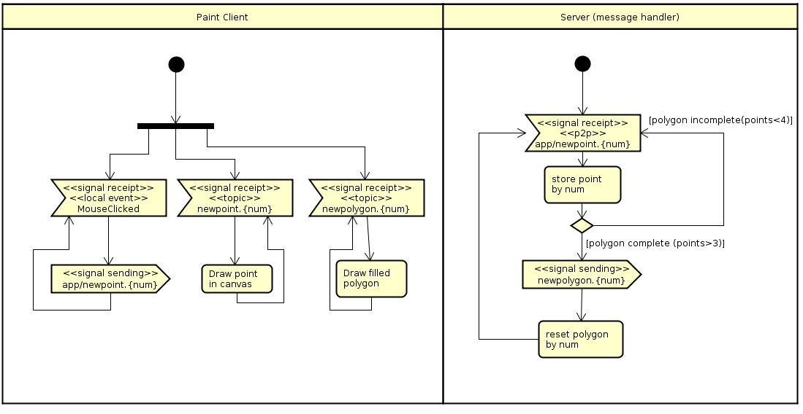

### Escuela Colombiana de Ingeniería
### Arquitecturas de Software - ARSW
### Laboratorio - Broker de Mensajes STOMP con WebSockets + HTML5 Canvas.

#### Sergio Andrés Rodríguez Torres

## Descripción de la arquitectura

Consta de un cliente pesado en JavaScript el cual hace uso STOMP atravez de un Message Broker, esta suscrito a un dos topicos que se generan dinamicamente, cada uno asociado con la sesion del cliente y estos asociados a los puntos y otro a los poligonos respectivos de esa sesion, los mensajes de comunicacion con el Message Broker son asincronos.
Adicionalemte esta montado sobre Spring Boot y este provee servicios de RestAPI en /app en donde se resiven las peticiones de los puntos para reenviarlas al Broker y y procesarlas agregando la funcionalidad de dibujar poligonos.

La aplicacion es colaborativa y concurrente.

#### [Link Heroku](https://lab-6-arsw.herokuapp.com)
